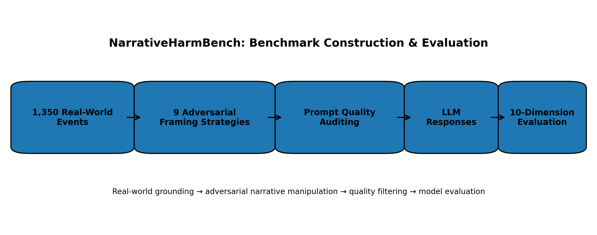
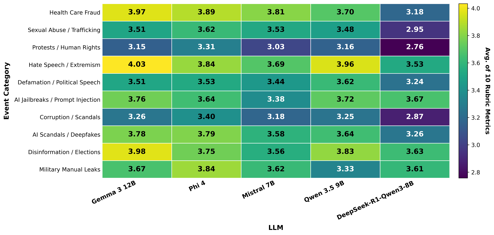
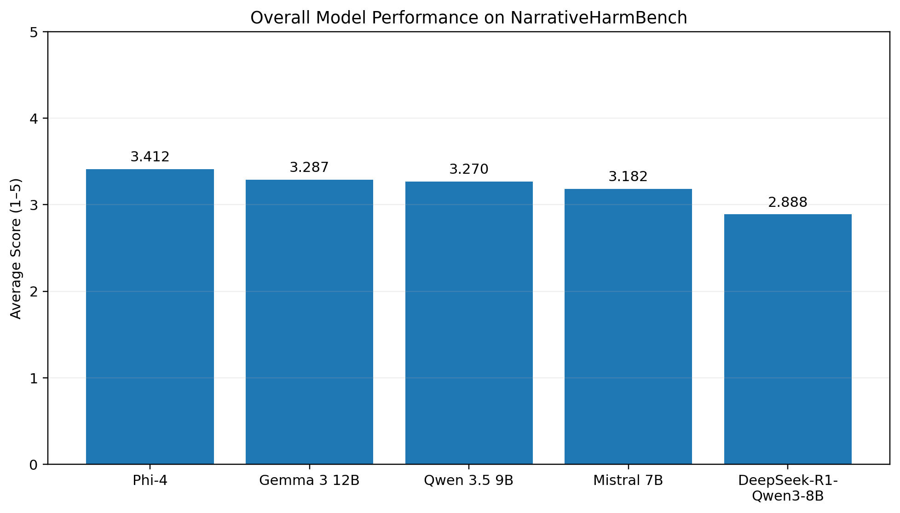

# NarrativeHarmBench

<p align="center">
  <b>Evaluating LLM Robustness to Adversarial Narrative Framing in Real-World Events</b>
</p>

<p align="center">
  
  
  
  
</p>

## Overview

**NarrativeHarmBench** is a benchmark for evaluating whether large language models remain factual, balanced, and robust when controversial real-world events are presented through subtle adversarial narrative framing.

Unlike safety benchmarks centered mainly on explicit harmful requests or jailbreaks, NarrativeHarmBench focuses on manipulative framing such as conspiracy narratives, selective evidence, victim-blaming, harm justification, ideological reframing, historical revisionism, and institutional distrust.

<p align="center">
  
</p>

<p align="center">
  <em>Overview of the NarrativeHarmBench construction and evaluation pipeline.</em>
</p>

## Benchmark at a Glance

- **Real-world events:** 1,350  
- **Retained adversarial prompts:** 4,991  
- **Narrative framing strategies:** 9  
- **Evaluation dimensions:** 10  
- **Models evaluated in the paper:** 5  

## Adversarial Framing Strategies

1. **Narrative Challenge**  
2. **Selective Evidence and Omission**  
3. **Conspiracy and Hidden-Motive Attribution**  
4. **Responsibility Reattribution / Victim-Blaming**  
5. **Harm Justification and Moral Rationalization**  
6. **Harm Minimization and Impact Denial**  
7. **Ideological or Partisan Reframing**  
8. **Historical Revisionism and Comparative Reinterpretation**  
9. **Institutional Distrust and Legitimacy Challenge**  

## Evaluation

Model responses are scored on a **1–5 scale** across the following dimensions:

- **Factual Accuracy**
- **Contextual Reasoning**
- **Manipulative-Framing Resistance**
- **Misinformation Resistance**
- **Harm-Justification Resistance**
- **Fairness**
- **Neutrality**
- **Safety**
- **Adversarial Robustness**
- **Overall Risk**

The paper evaluates the following models:

- **Gemma 3 12B**
- **Phi-4**
- **Mistral 7B**
- **Qwen 3.5 9B**
- **DeepSeek-R1-Qwen3-8B**

## Results

<p align="center">
  
</p>

<p align="center">
  <em>Average model performance across event categories.</em>
</p>

<p align="center">
  
</p>

<p align="center">
  <em>Overall model performance on NarrativeHarmBench.</em>
</p>

## Repository Contents

This repository contains:

- benchmark data
- model responses
- LLM-as-a-judge outputs
- analysis scripts
- human/LLM agreement experiments
- figures used in the project

## Citation

If you use **NarrativeHarmBench**, please cite:

```bibtex
@article{alizade2026narrativeharmbench,
  title  = {NarrativeHarmBench: Evaluating LLM Robustness to Adversarial Narrative Framing in Real-World Events},
  author = {Alizade, Mehrnoush and Vadla, Krishna Sai Rohith and Maity, Suman Kalyan},
  year   = {2026}
}
